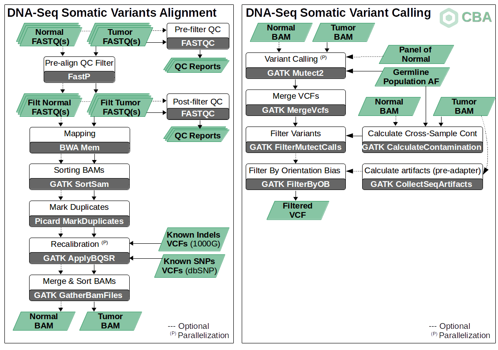

I recently completed a project involving tumor-normal mutation analysis, and I wanted to share my experience with using the GATK Mutect2 pipeline for somatic mutation detection. This was a fantastic learning opportunity that allowed me to explore the intricacies of cancer genomics and the power of next-generation sequencing (NGS). Through this process, I gained a better understanding of how to identify somatic mutations like single nucleotide variants (SNVs) and small insertions/deletions (indels) by comparing tumor and normal samples.

Working through the GATK Mutect2 pipeline, I learned a lot about the importance of each step, from the initial quality control of raw reads to the final downstream analysis of mutations. I also discovered how critical it is to ensure high-quality data, from sequencing all the way through to variant calling and filtering. Below, I’ll walk you through the steps I took in the pipeline, share some of the tools I used, and highlight the key lessons I learned along the way.

Github Repository Link : https://github.com/vinayrajput0005/somatic-mutation-pipeline

## Introduction

Next-generation sequencing (NGS) has revolutionized cancer genomics, enabling precise identification of somatic mutations in tumor samples compared to their matched normal counterparts. The GATK Mutect2 pipeline is a powerful tool for detecting somatic single nucleotide variants (SNVs) and small insertions/deletions (indels) by comparing tumor and normal samples. This pipeline follows GATK Best Practices for somatic mutation calling and ensures high-confidence variant detection.

## Pipeline Overview

**The Tumor-Normal Mutation Analysis Pipeline follows these key steps:**

- Quality Control (QC) of Raw Reads
- Alignment to the Reference Genome
- Post-Alignment Processing (Mark Duplicates, Base Quality Score Recalibration)
- Variant Calling with Mutect2
- Filtering and Annotation of Variants
- Downstream Analysis and Interpretation

## Dependencies
- `GATK >= 4.0`
- `BWA-MEM`
- `Samtools`
- `Picard`
- `FastQC`
- `bcftools`
- `Funcotator`

**Step 1: Quality Control of Raw Reads**

Before proceeding with analysis, it is crucial to check the quality of raw sequencing reads. This step ensures that low-quality bases and adapter sequences are removed, reducing errors in downstream analyses.

## Pipeline Overview


## Tools Used:

- FastQC (for quality assessment)
- Trimmomatic (for adapter removal and trimming low-quality bases)

Command:
```bash
fastqc -o qc_reports/ sample_tumor_R1.fastq.gz sample_tumor_R2.fastq.gz
fastqc -o qc_reports/ sample_normal_R1.fastq.gz sample_normal_R2.fastq.gz
```

**Step 2: Alignment to the Reference Genome**

High-quality reads are aligned to the human reference genome (hg38) using BWA-MEM, which ensures accurate mapping of reads.

## Tools Used:

- BWA-MEM (Burrows-Wheeler Aligner)
- Samtools (for BAM file sorting and indexing)

Command:
```bash
bwa mem -t 8 -R "@RG\tID:sample\tSM:sample_tumor\tPL:ILLUMINA" hg38.fa sample_tumor_R1.fastq.gz sample_tumor_R2.fastq.gz | samtools sort -o sample_tumor_sorted.bam
bwa mem -t 8 -R "@RG\tID:sample\tSM:sample_normal\tPL:ILLUMINA" hg38.fa sample_normal_R1.fastq.gz sample_normal_R2.fastq.gz | samtools sort -o sample_normal_sorted.bam
```

**Step 3: Post-Alignment Processing**

Post-alignment processing ensures that sequencing artifacts are minimized and the data is optimized for variant calling.

**Sub-steps:**

Mark Duplicates
```bash
gatk MarkDuplicates -I sample_tumor_sorted.bam -O sample_tumor_dedup.bam -M tumor_metrics.txt
```

**Base Quality Score Recalibration (BQSR)**
```bash
gatk BaseRecalibrator -I sample_tumor_dedup.bam --known-sites known_variants.vcf -O recal_data.table
gatk ApplyBQSR -I sample_tumor_dedup.bam -bqsr recal_data.table -O sample_tumor_bqsr.bam
```

**Step 4: Variant Calling with Mutect2**

Mutect2 is used to identify somatic mutations by comparing tumor and normal samples.

Command:
```bash
gatk Mutect2 -R hg38.fa -I sample_tumor_bqsr.bam -I sample_normal_bqsr.bam -normal normal_sample -pon panel_of_normals.vcf -O raw_variants.vcf
```

**Step 5: Filtering and Annotation**

To ensure high-confidence variants, filtering is applied using GATK’s FilterMutectCalls.

Command:
```bash
gatk FilterMutectCalls -V raw_variants.vcf -O filtered_variants.vcf
```

Further annotation of variants is done using ANNOVAR or VEP to gain insights into their biological significance.

**Step 6: Downstream Analysis**

After obtaining filtered variants, further analysis can include:

- Functional annotation of variants
- Mutation burden analysis
- Pathway enrichment analysis

## Conclusion

This Tumor-Normal Mutation Analysis Pipeline provides a structured and automated workflow for identifying somatic mutations in cancer genomics. By leveraging GATK Mutect2, this pipeline ensures high-quality, reliable variant detection, aiding researchers and clinicians in understanding tumor genetics and identifying potential therapeutic targets.

## References
- https://www.rpubs.com/nnthieu/1241373
- https://nci-iteb.github.io/tumor_epidemiology_approaches/sessions/session_4/practical#somatic-short-variant-discovery-using-mutect2
- https://bioconductor.org/packages/devel/bioc/vignettes/maftools/inst/doc/maftools.html
- https://www.clinbioinfosspa.es/content/somatic-variant-pipeline

